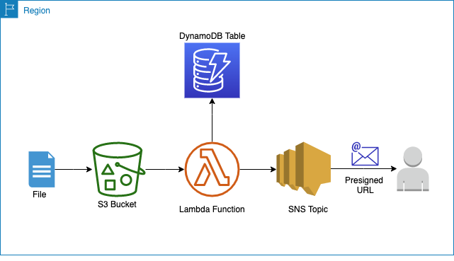

# CreatePresignedURLS3Object
A presigned URL is generated every time an object is put into an specific Amazon S3 bucket. 
The URL is published to an SNS topic and sent to the final user via email.
All generated URLs are stored in an Amazon DynamoDB table for tracking purposes, along with the creation and expiration times.

